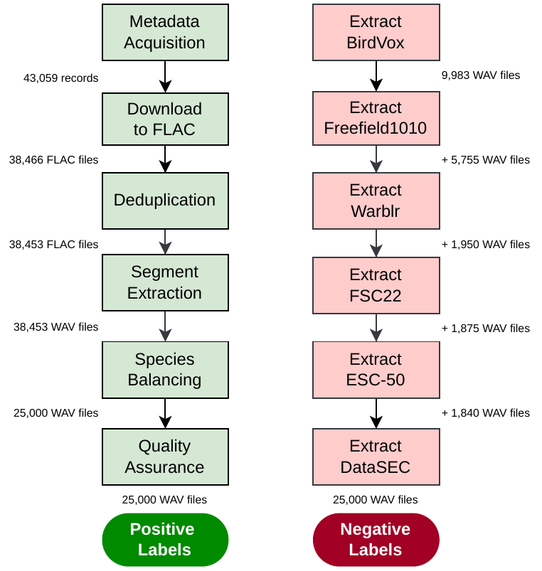

# SEABAD: Southeast Asian Bird Audio Detection Dataset

A dataset of **50,000 automatically curated 3-second clips** spanning more than **1,600 Southeast Asian bird species**, standardised to 16 kHz mono for binary bird presence–absence detection on edge devices.

> **Dataset**: [zenodo.org/records/18290494](https://zenodo.org/records/18290494)

> **Paper**: *SEABAD: A Tropical Bird Audio Detection Dataset for Passive Acoustic Monitoring* (preprint)

---

## Overview

Passive acoustic monitoring requires models that run on low-power hardware (AudioMoth, ARM Cortex-M). SEABAD addresses two gaps in existing datasets: **tropical soundscape coverage** and **3-second clip length** matching microcontroller inference windows.

| Property | Value |
|---|---|
| Total clips | 50,000 |
| Positive (bird present) | 25,000 |
| Negative (bird absent) | 25,000 |
| Unique bird species | 1,600+ |
| Clip duration | 3 seconds |
| Sample rate | 16 kHz mono |
| Bit depth | 16-bit PCM |
| Geography | Malaysia, Indonesia, Singapore, Brunei, Thailand |

### Baseline validation (standard CNNs, fine-tuned from ImageNet)

| Architecture | Accuracy | AUC |
|---|---|---|
| VGG16 | 99.82% | 99.96% |
| ResNet50 | 99.50% | 99.99% |
| EfficientNetB0 | 98.76% | 99.87% |
| MobileNetV3-Small | 99.44% | 99.83% |

---

## Repository Layout

```
seabad/
├── positive-label-curation/   # Stages 1–9: Xeno-Canto bird clips
├── negative-sample-curation/  # Stages 1–6: non-bird clips
└── validation/                # CNN baseline training & evaluation
```

---

## Curation Pipeline



### Positive pipeline highlights

- **Acoustic deduplication** — FAISS approximate nearest-neighbour search on mel-spectrogram embeddings; 13 duplicates removed from 38,466 recordings (0.03%)
- **Diversity-aware segment extraction** — RMS sliding window with 1.5 s minimum separation; one clip per source recording
- **Species balancing** — MiniBatch K-Means (5 clusters/species) + salience-ranked priority queue; Gini coefficient reduced from 0.601 → 0.519 (13.6%)
- **QA loop** — 500 random clips reviewed per round (Cochran n* = 639; two rounds satisfy 95% confidence at ±1.5 pp); wrong-onset corrections re-extracted from source FLACs

### Negative pipeline highlights

- Expert-annotated `hasbird = 0` clips from DCASE 2018 (BirdVox, Freefield1010, Warblrb10k)
- Forest and environmental sounds from FSC-22 and ESC-50 (avian classes excluded)
- Mediterranean soundscapes from DataSEC — cicadas, rain, wind, machinery, human voices
- All clips resampled to 16 kHz mono, no normalisation applied

---

## Quick Start

### Requirements

```bash
pip install pandas requests librosa soundfile tqdm scikit-learn matplotlib faiss-cpu numpy
```

For GPU FAISS: replace `faiss-cpu` with `faiss-gpu`.
System: `ffmpeg` required for audio conversion.

### Run the positive pipeline

```bash
cd positive-label-curation

python Stage1_xc_fetch_bird_metadata.py --country all   # ~10 min
python Stage2_analyze_metadata.py                        # optional stats
python Stage3_download_and_convert.py                    # ~2-6 h
python Stage4_deduplicate_flac.py --quarantine-all
python Stage5_extract_wav_from_flac.py --no-quarantine
python Stage6_balance_species.py
python Stage7_qa_spectrograms.py                         # generates PNG review sheets
python Stage8_adjust_onset.py                            # interactive QA tool
python Stage9_qa_apply_corrections.py                   # apply corrections
```

### Run the negative pipeline

```bash
cd negative-sample-curation

python Stage1_extract_birdvox.py
python Stage2_extract_freefield.py
python Stage3_extract_warblr.py
python Stage4_extract_fsc22.py
python Stage5_extract_esc50.py
python Stage6_extract_datasec.py
```

### Run baseline validation

```bash
cd validation

python Stage8_validate_mybad_pretrained.py --model mobilenetv3s --seed 42 \
    --dataset_dir /path/to/SEABAD/
```

Supported models: `mobilenetv3s`, `resnet50`, `vgg16`, `efficientnetb0`

---

## Dataset on Zenodo

The compiled 50,000-clip dataset with metadata is available at:
**[zenodo.org/records/18290494](https://zenodo.org/records/18290494)**

Includes:
- 50,000 × 3-second clips in WAV format (16 kHz mono, 16-bit PCM)
- Train / validation / test split CSVs (80/10/10, source-recording-aware)
- Full provenance metadata (Xeno-Canto IDs, coordinates, licenses)

---

## Audio Processing Standards

| Parameter | Value |
|---|---|
| Sample rate | 16,000 Hz |
| Channels | Mono |
| Clip duration | 3.0 s |
| Format | WAV PCM_16 (final), FLAC PCM_16 (intermediate) |
| Normalisation | None — intentionally minimal for edge realism |

---

## License

**Curation code**: MIT
**Positive clips**: inherit original Xeno-Canto Creative Commons licenses (CC BY, CC BY-SA, CC BY-NC, CC BY-NC-SA). Full attribution metadata included.
**Negative clips**: subject to the licenses of their source datasets (BirdVox, Freefield1010, Warblrb10k, FSC-22, ESC-50, DataSEC).

---

## Citation

If you use SEABAD or this curation pipeline, please cite:

```bibtex
@dataset{seabad2026,
  title   = {{SEABAD}: Southeast Asian Bird Audio Detection Dataset},
  year    = {2026},
  url     = {https://zenodo.org/records/18290494},
  note    = {50,000 curated 3-second clips spanning 1,600+ Southeast Asian bird species}
}
```

Source recordings from [Xeno-Canto](https://www.xeno-canto.org/). Please also credit the original recordists.
